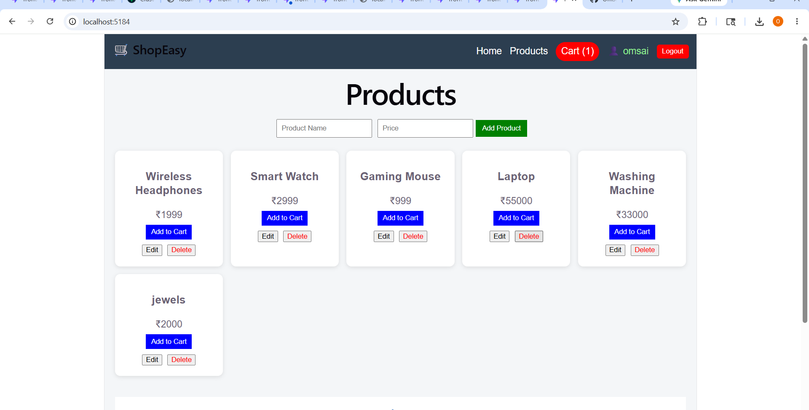

# MERN Stack E-Commerce Project

## Overview

This project is a full-stack MERN (MongoDB, Express.js, React.js, Node.js) web application developed as part of the CodeAlpha Internship Program.

The application demonstrates frontend-backend integration, user authentication, database connectivity, and product management functionalities.

---

## Features

* User Registration
* User Login Authentication
* Secure Backend API
* MongoDB Database Integration
* Product Management
* Responsive User Interface
* React Routing
* RESTful API Communication

---
## Project Screenshot

The screenshot below shows the main product management dashboard of the application.




## Technology Stack

### Frontend

* React.js
* React Router
* Axios
* CSS

### Backend

* Node.js
* Express.js

### Database

* MongoDB

---

## Project Structure

```
project-root/
│
├── frontend/
│   ├── src/
│   ├── public/
│   └── package.json
│
├── backend/
│   ├── routes/
│   ├── models/
│   ├── config/
│   ├── middleware/
│   └── server.js
│
├── .gitignore
├── package.json
└── README.md
```

---

## Installation

### Clone Repository

```bash
git clone <repository-url>
```

### Install Frontend Dependencies

```bash
cd frontend
npm install
```

### Install Backend Dependencies

```bash
cd backend
npm install
```

### Run Backend

```bash
npm start
```

### Run Frontend

```bash
npm run dev
```

---

## Learning Outcomes

Through this project, I learned:

* MERN Stack Development
* Git and GitHub Version Control
* API Development using Express.js
* MongoDB Database Operations
* Frontend and Backend Integration
* Authentication Flow Implementation

---

## Internship Project

Submitted for the CodeAlpha Internship Program.

---

## Author

Omsaipriya
